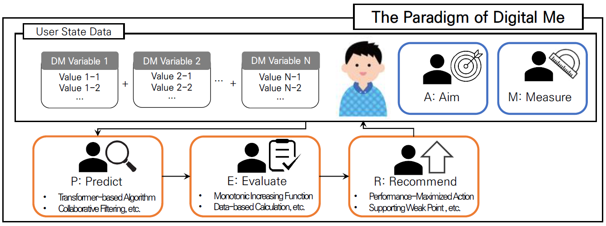

# AMPER (Aim-Measure-Predict-Evaluate-Recommend): The Paradigm of Digital Me



AMPER is a general Digital Me algorithm to manage the individual's state in real-time. We verify our proposed algorithm structure for the user-centric aim of improving the user's English score. 


## Method
The Digital Me algorithm utilizes user state data, according to user-centric objective A (Aim), to establish M (Measure) to measure the current state of the user. It only uses data to predict the user's future states through P (Predict). After evaluating the user's future states through E (Evaluate), it is possible to maximize the user's state improvement by providing an R (Recommendation) of behavior for achieving the target state.


## Dataset & Installation
First, download the [EdNet KT1 dataset](https://drive.google.com/file/d/1AmGcOs5U31wIIqvthn9ARqJMrMTFTcaw/view) and place the dataset in *'/data/EdNet-KT1/KT1'*. After that, proceed to download and run the code as follows.

```
git clone https://github.com/youngchan-k/AMPER.git
python main.py
```


Please refer to the [paper](https://github.com/youngchan-k/AMPER/blob/main/pdf/AMPER.pdf) and [slide](https://github.com/youngchan-k/AMPER/blob/main/pdf/AMPER_slide.pdf) if you want to see more details


