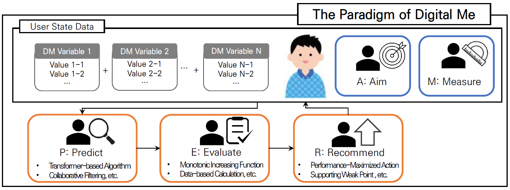

# Minimally Domain-Dependent and Privacy-Preserving Digital Me Algorithms
Digital Me is an AI-driven service that allows real-time management to reflect the user's goals, measures, predicts, and evaluates the individual's status, and recommends actions to improve the status. We develop minimally domain-dependent algorithms to simplify the development process and enhance the predictive accuracy and personalized recommendations.


For more information, please refer to the papers listed below.

**1) Towards Minimally Domain-Dependent and Privacy-Preserving Architecture and Algorithms for Digital Me Services: EdNet and MIMIC-III Experiments** *(HICSS 2025)*

**2) AMPER (Aim-Measure-Predict-Evaluate-Recommend): The Paradigm of Digital Me** *(ICEC 2022)*


## AMPER Framework


### Procedure Overview
The Digital Me algorithm utilizes user state data, according to user-centric objective **A (Aim)**, to establish **M (Measure)** to measure the current state of the user. It only uses data to predict the user's future states through **P (Predict)**. After evaluating the user's future states through **E (Evaluate)**, it is possible to maximize the user's state improvement by providing an **R (Recommendation)** of behavior for achieving the target state.

### Experiment with EdNet data
We demonstrate the effectiveness of our proposed algorithm structure in enhancing a user's English score. To begin, download the [EdNet KT1 dataset](https://drive.google.com/file/d/1AmGcOs5U31wIIqvthn9ARqJMrMTFTcaw/view) and place the dataset in `data/EdNet-KT1/KT1`. Ensure `csv/questions.csv` is present (see project structure). Then clone the repository and run:

```bash
git clone https://github.com/youngchan-k/AMPER.git
cd AMPER
python main.py
```

The pipeline runs: **preprocess** → **train** → **evaluate**.

### Requirements
- Python 3.x

Install dependencies:

```bash
pip install -r requirements.txt
```

### Project structure
Code is organized under the `amper` package:

```
AMPER/
├── main.py                 # Entry point: preprocess → train → evaluate
├── amper/
│   ├── config.py           # Paths and constants (CSV, data dirs, logs)
│   ├── data/
│   │   └── preprocess.py   # EdNet-KT1 preprocessing, split_data, main_data_preprocess
│   ├── model/
│   │   └── transformer.py  # Transformer, encoder/decoder, attention, masks
│   ├── training/
│   │   └── train.py        # dataframe_to_list, tokenizer, train_main
│   ├── evaluation/
│   │   └── eval.py         # evaluate, predict, eval_main
│   └── recommendation/
│       └── recommend.py    # user_question_matrix, recommend_question
├── csv/                    # Input/output CSVs (questions.csv required)
├── data/                   # Raw EdNet-KT1 data → place in data/EdNet-KT1/KT1
└── logs/                   # Checkpoints
```